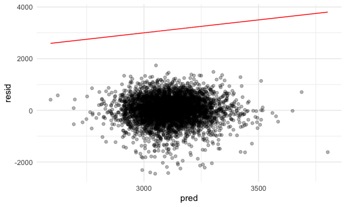
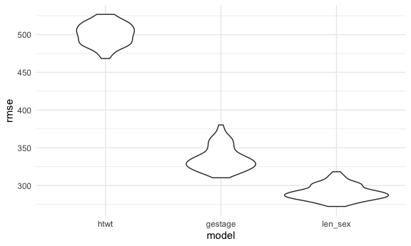
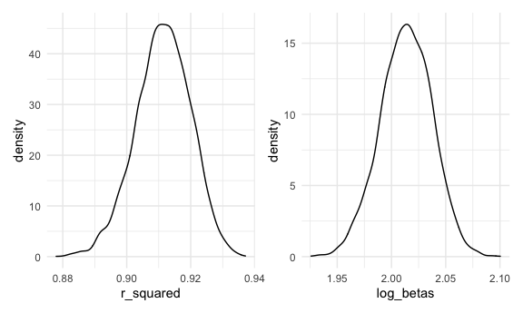

P8105 Homework 6
================
Rebekah Hughes

## Problem 1

The following code loads and cleans data on homicides in the United
States. Here, race is limited to white and black, and Tulsa, AL is
removed from the dataset because it is an error.

``` r
homicide_df = 
  read_csv("data/homicide-data.csv", na = c("", "NA", "Unknown")) %>% 
  mutate(
    city_state = str_c(city, state, sep = ", "),
    victim_age = as.numeric(victim_age),
    resolution = case_when(
      disposition == "Closed without arrest" ~ 0,
      disposition == "Open/No arrest"        ~ 0,
      disposition == "Closed by arrest"      ~ 1)
  ) %>% 
  filter(
    victim_race %in% c("White", "Black"),
    city_state != "Tulsa, AL") %>% 
  select(city_state, resolution, victim_age, victim_race, victim_sex)
```

The following code limits the data to Baltimore, MD and runs a logistic
regression with resolution of the case as the outcome and victim race,
sex, and age as the predictors.

``` r
baltimore_df =
  homicide_df %>% 
  filter(city_state == "Baltimore, MD")

glm(resolution ~ victim_age + victim_race + victim_sex, 
    data = baltimore_df,
    family = binomial()) %>% 
  broom::tidy() %>% 
  mutate(
    OR = exp(estimate),
    CI_lower = exp(estimate - 1.96 * std.error),
    CI_upper = exp(estimate + 1.96 * std.error)
  ) %>% 
  select(term, OR, starts_with("CI")) %>% 
  knitr::kable(digits = 3)
```

| term              |    OR | CI\_lower | CI\_upper |
| :---------------- | ----: | --------: | --------: |
| (Intercept)       | 1.363 |     0.975 |     1.907 |
| victim\_age       | 0.993 |     0.987 |     1.000 |
| victim\_raceWhite | 2.320 |     1.648 |     3.268 |
| victim\_sexMale   | 0.426 |     0.325 |     0.558 |

Given the above code, the adjusted odds ratio comparing non-white to
white victims is 2.320 with a 95% confidence interval of 1.648 to 3.268.

The following code runs a logistic regression for each of the cities in
the dataset for solving homicides comparing black victims and white
victims. The adjusted odds ratios and 95% confidence intervals for each
city are laid out in the resulting data frame.

``` r
models_results_df = 
  homicide_df %>% 
  nest(data = -city_state) %>% 
  mutate(
    models = 
      map(.x = data, ~glm(resolution ~ victim_age + victim_race + victim_sex, data = .x, family = binomial())),
    results = map(models, broom::tidy)
  ) %>% 
  select(city_state, results) %>% 
  unnest(results) %>% 
  mutate(
    OR = exp(estimate),
    CI_lower = exp(estimate - 1.96 * std.error),
    CI_upper = exp(estimate + 1.96 * std.error)
  ) %>% 
  select(city_state, term, OR, starts_with("CI")) 
```

The following code creates a plot showing the odds ratios and confidence
intervals for each of the cities in the dataset, organized by odds ratio
values.

``` r
models_results_df %>% 
  filter(term == "victim_sexMale") %>% 
  mutate(city_state = fct_reorder(city_state, OR)) %>% 
  ggplot(aes(x = city_state, y = OR)) + 
  geom_point() + 
  geom_errorbar(aes(ymin = CI_lower, ymax = CI_upper)) + 
  theme(axis.text.x = element_text(angle = 90, hjust = 1))
```


From the above plot, overall as the odds ratio gets larger, the
confidence intervals appear to get wider as well. New York, NY has the
smallest odds ratio comparing solved homicides of black victims and
white victims, while Albuquerque, NM has the highest odds ratio and
widest confidence interval.

## Problem 2

The following code loads and cleans a dataset containing data on baby
birthweight and other related variables, such as maternal age and
maternal height. Missing values are also counted here.

``` r
birthweight_df =
  read_csv("./data/birthweight.csv")

birthweight_df %>% 
  count(NA)
```

    ## # A tibble: 1 x 2
    ##   `NA`      n
    ##   <lgl> <int>
    ## 1 NA     4342

The following code creates a linear model with the outcome as baby
birthweight and the predictors as mother’s weight before pregnancy and
mother’s height. The fixed values are then modeled against the residuals
with a line of best fit included.

``` r
htwt_mod = lm (bwt ~ ppwt + mheight, data = birthweight_df)

birthweight_df %>% 
  add_residuals(htwt_mod) %>% 
  add_predictions(htwt_mod) %>% 
  ggplot(aes(x = pred, y = resid))+
  geom_point(alpha = .3) +
  geom_line(aes(y = pred), color = "red")
```



After the model is created, the model is used to add residuals and
predictions to the data and is then plotted with predictions on the
x-axis and residuals on the y-axis. The predictions are then used to
model a best fit line. Overall, the points lie beneath the best fit line
and do not cross the line at all.

The following code creates two more linear models with the same outcome
and different predictors from the model above, and manipulates the
models so that they can be plotted with the model created above.

``` r
ln_gestage_mod = lm (bwt ~ blength + gaweeks, data = birthweight_df)
hc_len_sex_mod = lm (bwt ~ bhead * blength * babysex, data = birthweight_df)


cv_df =
  crossv_mc(birthweight_df, 100) %>% 
  mutate(
    train = map(train, as_tibble),
    test = map(test, as_tibble)
  )
```

``` r
cv_df = 
  cv_df %>% 
  mutate(
    htwt_mod  = map(train, ~lm(bwt ~ ppwt + mheight, data = .x)),
    ln_gestage_mod     = map(train, ~lm(bwt ~ blength + gaweeks, data = .x)),
    hc_len_sex_mod  = map(train, ~lm(bwt ~ bhead * blength * babysex, data = .x))) %>% 
  mutate(
    rmse_htwt = map2_dbl(htwt_mod, test, ~rmse(model = .x, data = .y)),
    rmse_gestage    = map2_dbl(ln_gestage_mod, test, ~rmse(model = .x, data = .y)),
    rmse_len_sex = map2_dbl(hc_len_sex_mod, test, ~rmse(model = .x, data = .y)))
```

The following code chunk creates a plot based on the cross validated
prediction error created above. The model variable is modeled against
the rmse variable for the three models and is compared here.

``` r
cv_df %>% 
  select(starts_with("rmse")) %>% 
  pivot_longer(
    everything(),
    names_to = "model", 
    values_to = "rmse",
    names_prefix = "rmse_") %>% 
  mutate(model = fct_inorder(model)) %>% 
  ggplot(aes(x = model, y = rmse)) + geom_violin()
```



Of the three models in the above plot, the root mean squared error is
much larger in the `htwt` (mother’s weight before pregnancy and height)
model compared to the other two models. The root mean squared error is
overall smallest in the `len_sex` (head circumference, baby length and
sex) model. This indicates that the standard deviation of the residuals
for the `htwt` model are larger than the other two models overall and
the model isn’t good at predicting the observed data.

## Problem 3

The following code loads and cleans the weather data from NOAA in R.

``` r
weather_df = 
  rnoaa::meteo_pull_monitors(
    c("USW00094728"),
    var = c("PRCP", "TMIN", "TMAX"), 
    date_min = "2017-01-01",
    date_max = "2017-12-31") %>%
  mutate(
    name = recode(id, USW00094728 = "CentralPark_NY"),
    tmin = tmin / 10,
    tmax = tmax / 10) %>%
  select(name, id, everything())
```

The following code runs 5000 bootstrap samples and produces values for
two estimates.

``` r
bootstrap_data =
  weather_df %>% 
  bootstrap(5000, id = "strap_number") %>% 
  mutate(
    models = map(.x = strap, ~lm(tmax ~ tmin, data = .x)),
    results = map(models, broom::glance),
    results2 = map(models, broom::tidy)
  ) %>% 
  select(strap_number, results, results2) %>% 
  unnest(results) %>% 
  select(strap_number, r.squared, results2) %>% 
  unnest(results2) %>% 
  select(strap_number, r.squared, term, estimate) %>% 
  pivot_wider(
    names_from = term,
    values_from = estimate
  ) %>% 
  janitor::clean_names() %>% 
  group_by(strap_number, r_squared) %>% 
  summarize(
    log_betas = log(intercept * tmin))
```

The following code plots the distribution of the estimates found above.

``` r
r_plot =
  bootstrap_data %>% 
  ggplot(aes(x = r_squared)) +
  geom_density()

log_plot =
  bootstrap_data %>% 
  ggplot(aes(x = log_betas)) +
  geom_density()

r_plot + log_plot
```



The first plot for r squared is fairly consistent except between 0.91
and 0.92 when there is a dip in the density. The first plot is centered
around 0.91 it appears. The second plot for log of the betas multiplied
is fairly consistent as well except for a slight dip in the density
between 2.00 and 2.03. The second plot is centered around 2.00
approximately.

The following code uses the 5000 bootstrap estimates to create 95%
confidence intervals for each of the estimate values. They are laid out
in the data frame below.

``` r
bootstrap_df =
  bootstrap_data %>%
  group_by(strap_number, r_squared, log_betas) %>% 
  summarize(
    rsq_ci_lower = quantile(r_squared, 0.025),
    rsq_ci_upper = quantile(r_squared, 0.975),
    log_ci_lower = quantile(log_betas, 0.025),
    log_ci_upper = quantile(log_betas, 0.975),
  )
```
